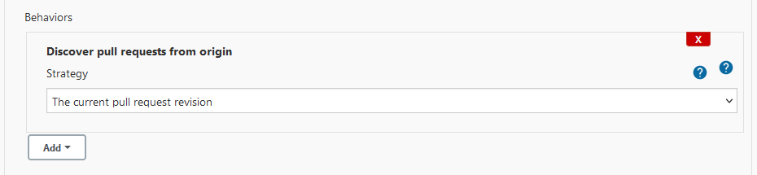

> NOTE: This plugin is incompatible with version 2.177 of Jenkins.
> Upgrading to 2.260 solves the issue. Please see #24 for more information.

# GitHub Pull Request Comment Build Plugin

[](https://plugins.jenkins.io/github-pr-comment-build)
[](https://plugins.jenkins.io/github-pr-comment-build)

## About this plugin

This plugin listens for comments on pull requests and will trigger a GitHub multibranch
job if a comment body matches the configured value, such as "rerun the build".
This is implemented as a branch property on multibranch jobs.

### Setup

For the plugin to work your multibranch job must use one of the "Discover pull requests from..." behaviors.
For example:


To enable the plugin's functionality, simply add one or more of the branch properties from
this plugin to the multibranch job and configure the regular expression to
match against the comment body.


Please ensure that you have a GitHub server properly connected via the Jenkins configuration,
or else the plugin will not operate correctly.

### Regular expression matching

The regex is not surrounded with any markers and uses the
`Pattern.CASE_INSENSITIVE` and `Pattern.DOTALL` Java flags.

For example, `^rerun the build$` only matches comments that contain no other
text besides "rerun the build" (case insensitive), while `rebuild` would match
comments such as

```
Please
rebuild this
```

and

```
Commence the rebuilding
```

If no pattern is provided, `^REBUILD$` is used.

### Untrusted Builds
This plugin only triggers builds from trusted users.
This is an incompatible change since July 2022 releases of the plugin.
If you would like untrusted users to be able to trigger builds,
check the "Allow Untrusted Users" checkbox. Use this feature with caution because
it may open up security issues with your Jenkins infrastructure.

### Using the PR Comment in a Pipeline Script

In order to use a PR comment in a pipeline script, the following code may be utilized. Note that this
depends on an experimental pipeline method call (`currentBuild.getCauses`) which may break in the future.

```groovy
// Comments
def commentCauses = currentBuild.getBuildCauses("com.adobe.jenkins.github_pr_comment_build.GitHubPullRequestCommentCause")
if (commentCauses) {
    for (def commentCause : commentCauses) {
        echo("""Comment Author: ${commentCause.commentAuthor}, Body: "${commentCause.commentBody}" (${commentCause.commentUrl})""")
    }
} else {
    echo("Build was not started by a PR comment")
}

// Labels
def labelCauses = currentBuild.getBuildCauses("com.adobe.jenkins.github_pr_comment_build.GitHubPullRequestLabelCause")
if (labelCauses) {
    for (def labelCause : labelCauses) {
        echo("""Label Author: ${labelCause.labellingAuthor}, Label: "${labelCause.label}" (${labelCause.labelUrl})""")
    }
} else {
    echo("Build was not started by a PR label")
}

// Reviews
def reviewCauses = currentBuild.getBuildCauses("com.adobe.jenkins.github_pr_comment_build.GitHubPullRequestReviewCause")
if (reviewCauses) {
    for (def reviewCause : reviewCauses) {
        echo("""Review Author: ${reviewCause.reviewAuthor} (${reviewCause.pullRequestUrl})""")
    }
} else {
    echo("Build was not started by a PR review")
}

// Updates
def updateCauses = currentBuild.getBuildCauses("com.adobe.jenkins.github_pr_comment_build.GitHubPullRequestUpdateCause")
if (updateCauses) {
    for (def updateCause : updateCauses) {
        echo("""Update Author: ${updateCause.updateAuthor} (${updateCause.pullRequestUrl})""")
    }
} else {
    echo("Build was not started by a PR update")
}
```

### GitHub organization folders

When using the GitHub organization folders approach to creating multibranch
pipeline jobs, the branch properties may not be edited [according to
design](https://issues.jenkins-ci.org/browse/JENKINS-33900?focusedCommentId=326187&page=com.atlassian.jira.plugin.system.issuetabpanels%3Acomment-tabpanel#comment-326187).
Instead, use the functionality built into the GitHub Plugin with using the
[issueCommentTrigger](https://github.com/jenkinsci/pipeline-github-plugin#issuecommenttrigger)
in your pipeline script. This works in a similar way to this plugin. The main
advantage of this plugin is that it may be used from the Job DSL plugin to
create jobs with this branch property already added (in the case when you don't
trust pipeline scripts, etc).

## Changelog

### Latest (Post September 20, 2021)

### Incremental Releases

Releases starting with `58.v945be9f1661f` have been moved to incremental
versioning. See the release history and log on the
[releases page](https://github.com/jenkinsci/github-pr-comment-build-plugin/releases).

### Older releases

#### 2.2 (November 6, 2020)

Add GitHub comment body in the cause object when a build is triggered
(thanks to @jebentier for PR #25).

#### 2.0 (June 15, 2017)

Support newer SCM/branch source plugins. Use this release if you are
using the 2.x releases of the SCM API-related plugins.

#### 1.1 (March 6, 2017)

Add support for building a job when a PR title or body is updated as
well by using a separate branch property.

#### 1.0 (January 23, 2017)

Initial release


## Plugin maintenance

### Releasing new versions

Use the instructions found [in the Jenkins docs](https://www.jenkins.io/doc/developer/publishing/releasing/) for GitHub
releases. The main point here is to make sure the PR that releases a new feature has the "enhancement" label on it, and
this will automatically trigger a new release.
