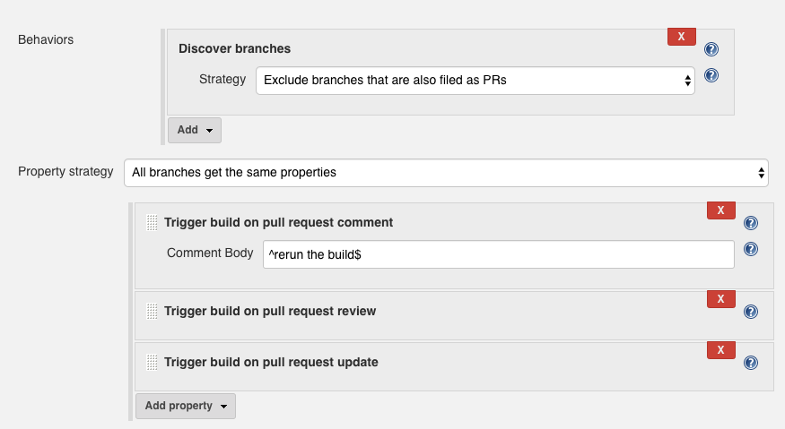

> NOTE: This plugin is incompatible with version 2.177 of Jenkins.
> Upgrading to 2.260 solves the issue. Please see #24 for more information.

# GitHub Pull Request Comment Build Plugin

[](https://plugins.jenkins.io/github-pr-comment-build)
[](https://plugins.jenkins.io/github-pr-comment-build)

## About this plugin

This plugin listens for comments on pull requests and will trigger a GitHub multibranch
job if a comment body matches the configured value, such as "rerun the build".
This is implemented as a branch property on multibranch jobs.

To enable this behavior, simply add one or more of the branch properties from
this plugin to the multibranch job and configure the regular expression to
match against the comment body.



Please ensure that you have a GitHub server properly connected via the Jenkins configuration,
or else the plugin will not operate correctly.

### Regular expression matching

The regex is not surrounded with any markers and uses the
`Pattern.CASE_INSENSITIVE` and `Pattern.DOTALL` Java flags.

For example, `^rerun the build$` only matches comments that contain no other
text besides "rerun the build" (case insensitive), while `rebuild` would match
comments such as

```
Please
rebuild this
```

and

```
Commence the rebuilding
```

If no pattern is provided, `^REBUILD$` is used.

### GitHub organization folders

When using the GitHub organization folders approach to creating multibranch
pipeline jobs, the branch properties may not be edited [according to
design](https://issues.jenkins-ci.org/browse/JENKINS-33900?focusedCommentId=326187&page=com.atlassian.jira.plugin.system.issuetabpanels%3Acomment-tabpanel#comment-326187).
Instead, use the functionality built into the GitHub Plugin with using the
[issueCommentTrigger](https://github.com/jenkinsci/pipeline-github-plugin#issuecommenttrigger)
in your pipeline script. This works in a similar way to this plugin. The main
advantage of this plugin is that it may be used from the Job DSL plugin to
create jobs with this branch property already added (in the case when you don't
trust pipeline scripts, etc).

## Changelog

### 2.2 (November 6, 2020)

Add GitHub comment body in the cause object when a build is triggered
(thanks to @jebentier for PR #25).

### 2.0 (June 15, 2017)

Support newer SCM/branch source plugins. Use this release if you are
using the 2.x releases of the SCM API-related plugins.

### 1.1 (March 6, 2017)

Add support for building a job when a PR title or body is updated as
well by using a separate branch property.

### 1.0 (January 23, 2017)

Initial release


## Plugin maintenance

### Releasing new versions

Use the instructions found [in the Jenkins docs](https://www.jenkins.io/doc/developer/publishing/releasing/).
